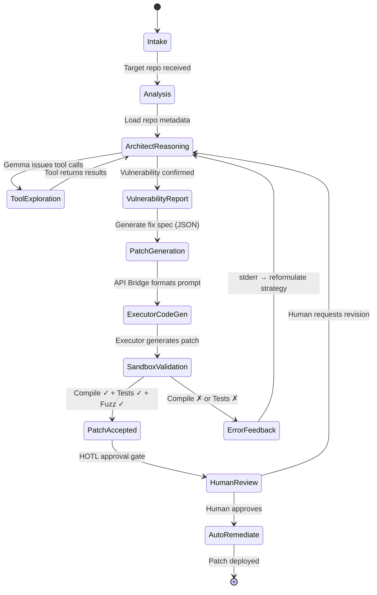

# Project SENTINEL
## Engineering Specification v2.0 — Elite Autonomous Vulnerability Auditor

> *A Gemma 4 31B Dense model, natively trained in NVFP4 on 8×NVIDIA B200 GPUs, engineered to autonomously discover, triage, and remediate software vulnerabilities at scale — with empirical safety alignment via automated DPO synthesis and dual-objective evaluation.*

---

## Executive Summary

Project SENTINEL constructs a **tier-one autonomous security asset** by combining three pillars:

1. **Native 4-bit training** — leveraging NVIDIA's published NVFP4 methodology to train a 31B dense model in a fraction of the time and compute of standard FP8 pipelines
2. **Agentic vulnerability hunting** — the model does not passively read code; it actively navigates repositories using LSP tooling, terminal access, and iterative call-chain assembly
3. **Empirical safety alignment** — DPO training on automatically synthesized red-team data steers the model toward defensive operation, validated through dual-objective evaluation (not formal guarantees)

The system deploys as a **heterogeneous dual-model architecture** governed by a deterministic state machine, with human defenders supervising execution telemetry in real-time.

---

## 1. Hardware & Compute Architecture

### 1.1 Infrastructure

| Component | Specification |
|---|---|
| **Node** | 1× DGX B200 (or equivalent) |
| **GPUs** | 8× NVIDIA B200 |
| **VRAM per GPU** | 192 GB HBM3e |
| **Aggregate VRAM** | 1,536 GB (~1.5 TB) |
| **Interconnect** | NVLink 5.0 (1.8 TB/s bidirectional) |
| **Base Model** | Gemma 4 31B Dense |
| **Training Precision** | NVFP4 (native 4-bit) |

### 1.2 Why Gemma 4 31B Dense

The dense architecture is a deliberate choice over Mixture-of-Experts (MoE):

- **Predictable fine-tuning** — no risk of "expert collapse" where specialized experts degrade during domain-specific SFT
- **Deterministic inference** — every token activates every parameter, eliminating routing variance that could cause inconsistent security assessments
- **Native reasoning** — Gemma 4's `<|think|>` block enables internal attack-graph mapping before output generation

### 1.3 NVFP4 Training Methodology

> [!IMPORTANT]
> Native NVFP4 training is validated by NVIDIA's published research: a 12B model trained on 10T tokens achieved 62.58% MMLU-pro accuracy, matching the FP8 baseline (62.62%). Reference: [arXiv:2509.25149](https://arxiv.org/abs/2509.25149)

The training pipeline implements NVIDIA's four-component methodology:

```
┌─────────────────────────────────────────────────────────────┐
│                   NVFP4 Training Stack                      │
├─────────────────────────────────────────────────────────────┤
│  1. Random Hadamard Transforms (RHT)                        │
│     → 16×16 matrices on Wgrad inputs                        │
│     → Redistributes block-level outliers into Gaussian      │
│     → Single fixed random sign vector across all layers     │
│                                                             │
│  2. Two-Dimensional Block Scaling                           │
│     → Weights: 16×16 2D blocks (forward/backward parity)   │
│     → Activations & Gradients: 1×16 1D blocks              │
│     → Two-level: FP32 tensor-scale + E4M3 block-scale      │
│                                                             │
│  3. Stochastic Rounding (Gradients Only)                    │
│     → Eliminates quantization bias in backward pass         │
│     → Round-to-nearest-even for weights and activations     │
│     → Critical for convergence at multi-trillion tokens     │
│                                                             │
│  4. Selective High-Precision Layers (15%)                   │
│     → First 2 blocks + last 8 blocks remain in BF16        │
│     → Final layers require more dynamic range than FP4      │
│     → Remaining 85% of linear layers in NVFP4              │
└─────────────────────────────────────────────────────────────┘
```

**Software:** [NVIDIA Transformer Engine](https://github.com/NVIDIA/TransformerEngine/pull/2177) with native NVFP4 support on Blackwell.

### 1.4 Parallelism Strategy — ZeRO-2 + Context Parallelism

> [!WARNING]
> The 31B model in NVFP4 is only ~17 GB. Tensor Parallelism across 8 GPUs would slice a 17 GB model into 2 GB shards — the GPUs would spend more time on NVLink activation transfers than on actual compute. Pure Data Parallelism (DDP) also fails because Adam optimizer states alone require ~372 GB, exceeding a single GPU's 192 GB capacity.

**Base strategy: ZeRO Stage 2** — shard optimizer states and gradients across GPUs while replicating model weights.

> [!IMPORTANT]
> ZeRO-2 shards optimizer state and gradients, but does **NOT** shard activations or model parameters. For the 8K-context core phase, the ~113 GB activation budget per GPU is sufficient. For 32K+ contexts, activation memory grows quadratically and exceeds per-GPU capacity. Phases B and C therefore layer **Context Parallelism (CP)** on top of ZeRO-2, splitting the sequence dimension across GPU pairs (CP=2 at 32K, CP=4-8 at 128K). This reduces the effective data-parallel degree proportionally.

#### Per-GPU VRAM Budget (ZeRO-2, Phase A — 8K context)

| Component | Per-GPU Memory | Calculation |
|---|---|---|
| Model weights (NVFP4) | 17 GB | 31B × 0.5 bytes + scale overhead |
| Master weights (FP32, replicated) | — | Held by ZeRO shard |
| Optimizer shard (FP32 master + Adam m + Adam v) | 46.5 GB | (124 + 124 + 124) GB / 8 GPUs |
| Gradient shard (FP32) | 15.5 GB | 124 GB / 8 GPUs |
| **Fixed overhead** | **~79 GB** | |
| **Available for activations** | **~113 GB** | 192 - 79 |

For Phase A (8K), each GPU processes independent batches and synchronizes gradients over NVLink 5.0. For Phases B/C, Context Parallelism distributes activation memory via ring attention, and the effective DP degree drops to `num_gpus / cp_degree`.

#### Optimizer Selection

| Optimizer | Per-GPU Fixed | Activation Budget | Status |
|---|---|---|---|
| **Adam** (β₁=0.9, β₂=0.95) | ~79 GB | ~113 GB | **Primary — validated with NVFP4** |
| **Muon** (no second moment) | ~63 GB | ~129 GB | Candidate — requires ablation study |

> [!NOTE]
> Muon eliminates Adam's second moment state, recovering ~16 GB/GPU. This enables ~14% larger batch sizes. However, Muon's orthogonalization step (Newton-Schulz iterations) creates different gradient distributions that are **untested with NVFP4's stochastic rounding and RHT**. A 1.2B-scale ablation (NVFP4 + Muon vs. NVFP4 + Adam, 100B tokens, ~2 days) must validate compatibility before committing at 31B scale.

---

## 2. Phase 1: High-Velocity Data Curation

**Timeline: Weeks 1–3 (21 days)**

### 2.1 The "Commit Delta" Strategy

> [!IMPORTANT]
> We strictly avoid training on raw open-source code repositories. Empirical analysis of corpora like The Stack v2 reveals that ~58% of code blobs are unmaintained and contain thousands of known CVEs. Training on this data teaches the model to *write* vulnerable code, not to *fix* it.

**Core Principle:** Train exclusively on the mathematical delta between a vulnerable commit and its secure, patched counterpart.

```
┌──────────────────────────────────────────────────────────────┐
│              Commit Delta Extraction Pipeline                │
│                                                              │
│  Source Repositories                                         │
│  ├── CVEFixes dataset (5,495 vulnerability-fixing commits)   │
│  ├── OSV.dev advisories → linked Git commits                 │
│  ├── GitHub Security Advisories (GHSA)                       │
│  └── NVD → mapped to upstream patches                        │
│                                                              │
│  Extraction Logic                                            │
│  ├── For each CVE:                                           │
│  │   ├── Isolate the fixing commit SHA                       │
│  │   ├── Extract parent commit (vulnerable state)            │
│  │   ├── Compute unified diff                                │
│  │   ├── Extract ±3 function-level context around changes    │
│  │   ├── Map to CWE taxonomy (CWE-20, CWE-79, CWE-119...)   │
│  │   └── Generate structured training sample:                │
│  │       {                                                   │
│  │         "vulnerable_code": "<parent state>",              │
│  │         "patched_code": "<fixed state>",                  │
│  │         "diff": "<unified diff>",                         │
│  │         "cwe": "CWE-787",                                 │
│  │         "severity": "CRITICAL",                           │
│  │         "explanation": "<why this fix works>"             │
│  │       }                                                   │
│  └── Quality filters:                                        │
│      ├── Reject commits touching >20 files (noisy refactors) │
│      ├── Reject diffs >4,096 tokens (out of scope)           │
│      └── Require linked CVE or security advisory             │
│                                                              │
│  Target: 50,000–100,000 high-quality delta pairs             │
└──────────────────────────────────────────────────────────────┘
```

### 2.2 Agentic Augmentation (Multi-Turn Synthesis)

Raw commit deltas teach *patch mechanics*. To teach *investigative reasoning* — the ability to navigate a codebase, trace data flows, and identify attack surfaces — we generate multi-turn conversational samples:

```
SYSTEM: You are a security auditor. Use the provided tools to
        investigate the codebase for vulnerabilities.

TURN 1 [Model]: I'll start by examining the entry points.
        <tool_call>grep -rn "request\." src/controllers/</tool_call>

TURN 2 [Tool Output]: src/controllers/upload.py:42:
        filename = request.files['doc'].filename

TURN 3 [Model]: <|think|>The filename comes directly from user
        input without sanitization. I need to trace where this
        variable is used downstream...</|think|>
        <tool_call>cat src/controllers/upload.py</tool_call>

TURN 4 [Tool Output]: [file contents showing os.path.join usage]

TURN 5 [Model]: This is CWE-22 (Path Traversal). The filename
        from request.files is passed directly to os.path.join()
        without sanitization. An attacker can upload a file with
        name "../../etc/passwd" to write outside the upload dir.

        RECOMMENDED FIX:
        ```python
        from werkzeug.utils import secure_filename
        filename = secure_filename(request.files['doc'].filename)
        ```
```

**Generation method:** Use an existing strong model (e.g., Gemini 2.5 Pro) to synthesize these multi-turn traces against known-vulnerable open-source projects, then validate the identified vulnerabilities against ground-truth CVE databases.

**Target:** 20,000–30,000 multi-turn agentic traces.

### 2.3 Supply Chain Integrity

All ingested datasets are integrity-verified:

- **Cryptographic hashing** — SHA-256 checksums for every sample, stored in a tamper-evident Merkle tree
- **Provenance tracking** — each sample links to its source commit SHA, CVE ID, and advisory URL
- **Contamination scanning** — automated detection of known benchmark samples (CyberSecEval, SWE-bench) to prevent data leakage
- **Human audit sampling** — 5% random audit of training samples by security engineers

---

## 3. Phase 2: Supervised Fine-Tuning (SFT)

**Timeline: Weeks 4–6 (21 days)**

### 3.1 Phased Context Extension

> [!IMPORTANT]
> At 256K context, activation memory dominates VRAM. A single sample through a 31B dense model at 256K context consumes ~80-120 GB in activations. The correct strategy is phased training: learn vulnerability mechanics at short context, then extend to full-codebase analysis at long context.

| Phase | Context Length | Batch Size (per GPU) | Tokens/Step | Duration | Purpose |
|---|---|---|---|---|---|
| **A: Core SFT** | 8,192 | 8–16 | ~524K–1M | 14 days | Learn commit-delta patch mechanics, CWE taxonomy, reasoning patterns |
| **B: Context Extension** | 32,768 | 2–4 | ~262K–524K | 5 days | Multi-file vulnerability tracing, cross-module data flow analysis |
| **C: Long-Range** | 131,072 | 1 | ~131K | 2 days | Full repository-scale call-chain assembly, architecture-level threat modeling |

**Context extension method:** YaRN (Yet another RoPE extensioN) with NTK-aware interpolation. The base Gemma 4 RoPE frequencies are scaled progressively across phases — no architectural changes required.

### 3.2 Internal Reasoning Integration

The model is explicitly trained to use Gemma 4's native `<|think|>` block for internal deliberation before producing output:

```
Before generating any vulnerability assessment, the model must:

1. <|think|> Map the attack graph
   └── Identify all user-controlled inputs (sources)
   └── Trace data flow to security-sensitive operations (sinks)
   └── Enumerate all sanitization/validation checkpoints

2. <|think|> Evaluate theoretical severity
   └── Assess exploitability (network vs. local, auth required?)
   └── Estimate impact (confidentiality, integrity, availability)
   └── Assign preliminary CVSS 4.0 vector

3. <|think|> Formulate remediation strategy
   └── Identify the minimal code change that eliminates the vuln
   └── Verify the fix doesn't break existing functionality
   └── Consider defense-in-depth (secondary mitigations)
```

### 3.3 Training Configuration

```yaml
# Phase A: Core SFT
model: gemma-4-31b-dense
precision: nvfp4
optimizer: adam  # or muon, pending ablation
learning_rate: 2e-5
lr_schedule: cosine_with_warmup
warmup_steps: 500
weight_decay: 0.1
max_seq_length: 8192
per_device_batch_size: 8
gradient_accumulation_steps: 4
effective_batch_size: 256  # 8 GPUs × 8 batch × 4 accum
num_epochs: 3
framework: nvidia-transformer-engine + deepspeed-zero2

# High-precision layers (BF16): first 2 + last 8 blocks
# Remaining 85% of linear layers: NVFP4
# RHT: 16×16 on Wgrad inputs
# Stochastic rounding: gradients only
# 2D scaling: 16×16 blocks for weights
```

---

## 4. Phase 3: Safety & Utility Alignment

**Timeline: Weeks 7–9 (21 days)**

### 4.1 Automated Red-Team DPO Synthesis Pipeline

> [!CAUTION]
> Manual curation of chosen/rejected pairs for zero-day exploits is infeasible at scale. We implement a fully automated closed-loop pipeline inspired by DARPA AIxCC architectures.

```
┌────────────────────────────────────────────────────────────────┐
│           Automated DPO Data Synthesis Pipeline                │
│                                                                │
│  ┌──────────┐     ┌──────────┐     ┌──────────────────┐       │
│  │  INPUT    │────▶│  GEMMA   │────▶│  DOCKER SANDBOX  │       │
│  │ Vuln Code │     │ Generate │     │  Compile + Fuzz  │       │
│  └──────────┘     │  Patch   │     └────────┬─────────┘       │
│                   └──────────┘              │                  │
│                                    ┌────────▼─────────┐       │
│                                    │   EVALUATION      │       │
│                                    │                    │       │
│                                    │ Compiles?  ──No──▶ REJECT │
│                                    │ Tests pass? ─No──▶ REJECT │
│                                    │ Fuzzer crash? Yes─▶ REJECT │
│                                    │ Vuln fixed?  ─No──▶ REJECT │
│                                    │                    │       │
│                                    │ All pass? ───Yes──▶ CHOSEN │
│                                    └────────┬─────────┘       │
│                                             │                  │
│                   ┌─────────────────────────▼──────────┐      │
│                   │     DPO TRAINING DATASET            │      │
│                   │                                     │      │
│                   │  { prompt: <vuln_code>,              │      │
│                   │    chosen: <working_secure_patch>,   │      │
│                   │    rejected: <failed_attempt> }      │      │
│                   └─────────────────────────────────────┘      │
└────────────────────────────────────────────────────────────────┘
```

**Differential Fuzzing Enhancement:** Both the original vulnerable code AND the patched code are fuzzed through identical harnesses. A valid "chosen" sample must satisfy:
- `crashes_on_original == True` (confirms the vulnerability is real)
- `crashes_on_patch == False` (confirms the patch actually fixes it)

This eliminates false positives where the model "fixes" a bug that wasn't actually exploitable.

**Target:** 50,000+ automatically generated preference pairs, continuously growing as the pipeline runs.

### 4.2 Direct Preference Optimization (DPO)

DPO directly updates the model's policy weights using a binary cross-entropy loss over the preference dataset, bypassing the need for a separate reward model:

```
L_DPO = -E[log σ(β · (log π_θ(chosen|x) / log π_ref(chosen|x)
                     - log π_θ(rejected|x) / log π_ref(rejected|x)))]
```

| Parameter | Value | Rationale |
|---|---|---|
| β (temperature) | 0.1 | Standard for code generation tasks |
| Learning rate | 5e-7 | 40× lower than SFT to preserve learned capabilities |
| Epochs | 1 | Single pass to prevent overfitting on synthetic data |
| Reference model | Frozen SFT checkpoint | From Phase 2 |

### 4.3 The "PurpCode" CWE Rule Learning

Every model output must ground its findings in established vulnerability taxonomies:

```json
{
  "finding": {
    "title": "SQL Injection via unsanitized user input",
    "cwe": "CWE-89",
    "severity": "CRITICAL",
    "cvss_v4": "CVSS:4.0/AV:N/AC:L/AT:N/PR:N/UI:N/VC:H/VI:H/VA:H",
    "location": "src/api/users.py:127",
    "vulnerable_code": "cursor.execute(f\"SELECT * FROM users WHERE id={user_id}\")",
    "secure_alternative": "cursor.execute(\"SELECT * FROM users WHERE id=%s\", (user_id,))",
    "explanation": "User-controlled input is interpolated directly into SQL query string without parameterization, allowing arbitrary SQL execution.",
    "references": ["https://cwe.mitre.org/data/definitions/89.html"]
  }
}
```

### 4.4 Over-Refusal Prevention (Dual-Objective Evaluation)

> [!WARNING]
> A model that refuses to analyze any potentially dangerous code is useless as a security tool. We optimize against dual evaluators to prevent "safety lobotomy."

| Evaluator | Signal | Weight |
|---|---|---|
| **Safety Oracle** | Penalizes generation of weaponized exploits, shellcode, or attack payloads intended for offensive use | 0.6 |
| **Utility Oracle** | Verifies the model can still analyze real-world vulnerable code, produce working patches, and explain exploitation mechanics for defensive purposes | 0.4 |

The utility oracle uses the automated compilation sandbox from §4.1 — if the model's "safe" output fails to compile or doesn't actually fix the vulnerability, the utility score drops.

---

## 5. Phase 4: Production Deployment Architecture

**Timeline: Weeks 10–12 (21 days)**

### 5.1 The Agentic Retrieval Harness

> [!IMPORTANT]
> The model does NOT receive entire codebases as raw text input. It operates as an autonomous agent with tool access, navigating repositories like a human security engineer.

```
┌─────────────────────────────────────────────────────────────────┐
│                    SENTINEL Agent Harness                        │
│                                                                  │
│  ┌──────────────────────────────────────────────────────────┐   │
│  │  GEMMA 4 31B (Architect)                                  │   │
│  │  ┌────────────────────────────────────────────────────┐   │   │
│  │  │  Working Memory (32K–128K active context window)   │   │   │
│  │  │  ├── Current hypothesis / attack graph             │   │   │
│  │  │  ├── Retrieved code fragments (2–4K per retrieval) │   │   │
│  │  │  ├── Tool call history                             │   │   │
│  │  │  └── Accumulated findings                          │   │   │
│  │  └────────────────────────────────────────────────────┘   │   │
│  └──────────────┬───────────────────────────────────────────┘   │
│                 │ Tool Calls                                     │
│  ┌──────────────▼───────────────────────────────────────────┐   │
│  │  TOOL LAYER (Sandboxed)                                   │   │
│  │                                                            │   │
│  │  ┌─────────────┐  ┌──────────────┐  ┌────────────────┐   │   │
│  │  │  LSP Client  │  │  Terminal     │  │  Semantic      │   │   │
│  │  │              │  │              │  │  Search         │   │   │
│  │  │ • go-to-def  │  │ • grep -rn   │  │                │   │   │
│  │  │ • find-refs  │  │ • find . -name│  │ • Embedding    │   │   │
│  │  │ • hover-info │  │ • cat <file> │  │   similarity   │   │   │
│  │  │ • call-hier  │  │ • git log    │  │ • AST-aware    │   │   │
│  │  │ • diagnostics│  │ • git diff   │  │   chunking     │   │   │
│  │  └─────────────┘  └──────────────┘  └────────────────┘   │   │
│  │                                                            │   │
│  │  ┌─────────────┐  ┌──────────────┐  ┌────────────────┐   │   │
│  │  │  Compiler    │  │  Fuzzer      │  │  SAST Scanner  │   │   │
│  │  │              │  │              │  │                │   │   │
│  │  │ • gcc/clang  │  │ • AFL++      │  │ • Semgrep      │   │   │
│  │  │ • rustc      │  │ • libFuzzer  │  │ • CodeQL       │   │   │
│  │  │ • python -c  │  │ • Jazzer     │  │ • Bandit       │   │   │
│  │  └─────────────┘  └──────────────┘  └────────────────┘   │   │
│  └──────────────────────────────────────────────────────────┘   │
└─────────────────────────────────────────────────────────────────┘
```

**Key design principle:** The context window is a *working memory buffer*, not a data dump. At any given time, the model holds only the relevant 2–4K tokens retrieved through its last tool call, plus its running hypothesis and findings. This eliminates "lost-in-the-middle" attention degradation entirely.

### 5.2 Heterogeneous "Alloy" — Dual-Model State Machine

The Gemma 4 31B model acts as the **Architect** (strategic reasoning, vulnerability analysis, remediation planning). A fast, code-centric model (e.g., DeepSeek-Coder or Codestral) acts as the **Executor** (raw code generation, script synthesis, rapid iteration).

They do not communicate freely. They are governed by a **deterministic state machine**:



#### Node Specifications

| Node | Model | Input | Output | Max Retries |
|---|---|---|---|---|
| **ArchitectReasoning** | Gemma 4 31B | Repo context + tool results | Vulnerability hypothesis + tool calls | ∞ (iterative exploration) |
| **VulnerabilityReport** | Gemma 4 31B | Accumulated findings | Structured JSON report (CWE, CVSS, location) | 1 |
| **API Bridge** | Deterministic Python | Gemma's JSON schema | Formatted executor prompt | N/A |
| **ExecutorCodeGen** | DeepSeek-Coder / Codestral | Formatted prompt + vuln context | Python/C/Bash patch code | 3 |
| **SandboxValidation** | Docker + AFL++ + compiler | Generated code | Pass/Fail + stderr/stdout | N/A |
| **ErrorFeedback** | Deterministic Python | stderr/stdout logs | Cleaned error context for Architect | N/A |

### 5.3 Human-On-The-Loop (HOTL) Integration

```
┌─────────────────────────────────────────────────────────┐
│              HOTL Autonomy Tiers                         │
├─────────────────────────────────────────────────────────┤
│                                                          │
│  TIER 1 — Full Autonomy (No Human Approval)              │
│  ├── Read-only repository scanning                       │
│  ├── Vulnerability report generation                     │
│  ├── SAST/fuzzer execution in isolated sandbox           │
│  └── Alert creation in ticketing system                  │
│                                                          │
│  TIER 2 — Auto-Execute with Notification                 │
│  ├── Endpoint network isolation (quarantine)             │
│  ├── WAF rule injection (block exploit pattern)          │
│  ├── Certificate rotation                                │
│  └── Human notified within 30 seconds                    │
│                                                          │
│  TIER 3 — Human Approval Required                        │
│  ├── Production code deployment (patches)                │
│  ├── Infrastructure configuration changes                │
│  ├── Access control modifications                        │
│  └── Any action affecting data integrity                 │
│                                                          │
│  MONITORING                                              │
│  ├── Real-time execution telemetry dashboard             │
│  ├── Full audit log of all model decisions               │
│  ├── Anomaly detection on model behavior patterns        │
│  └── Kill switch: immediate halt of all autonomous ops   │
│                                                          │
└─────────────────────────────────────────────────────────┘
```

---

## 6. Evaluation & Benchmarks

The model is evaluated against established security benchmarks before deployment:

| Benchmark | Target Score | What It Measures |
|---|---|---|
| **CyberSecEval 3** (Meta) | >75% | Secure code generation, vulnerability identification |
| **CVEFixes Test Split** | >80% fix rate | Ability to generate correct patches for real CVEs |
| **SWE-bench Verified** | >45% | End-to-end repository-level bug fixing |
| **PurpleLlama Insecure Code** | <5% generation rate | Refusal to generate vulnerable code when prompted |
| **Custom Red-Team Suite** | <2% jailbreak rate | Resistance to prompt injection / role-play attacks |
| **MITRE ATT&CK Coverage** | >60% of techniques recognized | Breadth of threat knowledge |

---

## 7. Project Timeline

```
Week  1  2  3  4  5  6  7  8  9  10  11  12
      ├──────────┤
      │ PHASE 1  │  Data Curation
      │ 21 days  │  • Commit delta extraction
      │          │  • Multi-turn trace synthesis
      │          │  • Quality filtering & auditing
      │          │  • Muon ablation study (parallel)
      │          │
      │          ├──────────────┤
      │          │   PHASE 2    │  Supervised Fine-Tuning
      │          │   21 days    │  • Phase A: 8K context (14d)
      │          │              │  • Phase B: 32K context (5d)
      │          │              │  • Phase C: 128K context (2d)
      │          │              │
      │          │              ├──────────────┤
      │          │              │   PHASE 3    │  DPO Alignment
      │          │              │   21 days    │  • Synthesis pipeline (7d)
      │          │              │              │  • DPO training (7d)
      │          │              │              │  • Eval & iteration (7d)
      │          │              │              │
      │          │              │              ├──────────────┤
      │          │              │              │   PHASE 4    │
      │          │              │              │   21 days    │
      │          │              │              │  • Harness build (10d)
      │          │              │              │  • State machine (5d)
      │          │              │              │  • Integration (3d)
      │          │              │              │  • Red team (3d)
      │          │              │              │
──────┴──────────┴──────────────┴──────────────┴──────────────┘

TOTAL: 12 weeks (84 days) from data curation to deployment-ready
```

### Detailed Time Breakdown

| Phase | Task | Duration | Parallelizable? |
|---|---|---|---|
| **1.1** | Commit delta extraction & filtering | 10 days | — |
| **1.2** | Multi-turn agentic trace synthesis | 8 days | Yes, with 1.1 |
| **1.3** | Data quality audit & integrity verification | 3 days | After 1.1 + 1.2 |
| **1.4** | Muon vs Adam ablation (1.2B, 100B tokens) | 2 days | Yes, with all Phase 1 |
| **2.A** | Core SFT — 8K context, 3 epochs | 14 days | — |
| **2.B** | Context extension — 32K | 5 days | After 2.A |
| **2.C** | Long-range extension — 128K | 2 days | After 2.B |
| **3.1** | Build DPO synthesis sandbox (Docker + fuzzer) | 7 days | Yes, starts Week 5 |
| **3.2** | Run synthesis pipeline (50K+ pairs) | 7 days | After 3.1 + Phase 2 |
| **3.3** | DPO training + evaluation + iteration | 7 days | After 3.2 |
| **4.1** | Agent harness (LSP + terminal + tools) | 10 days | Yes, starts Week 8 |
| **4.2** | State machine orchestrator | 5 days | After 4.1 |
| **4.3** | End-to-end integration testing | 3 days | After 4.2 |
| **4.4** | Adversarial red-team evaluation | 3 days | After 4.3 |

> [!TIP]
> With aggressive parallelization (harness development overlapping with DPO training, synthesis pipeline starting during SFT), the critical path can be compressed to **~10 weeks**. The 12-week estimate includes buffer for iteration cycles when evaluation benchmarks reveal gaps.

---

## 8. Risk Registry

| Risk | Severity | Probability | Mitigation |
|---|---|---|---|
| NVFP4 training diverges at 31B scale | HIGH | LOW | Validated at 12B by NVIDIA. Fallback: switch final 20% to BF16 (per paper's Appendix D) |
| Insufficient commit-delta training data | HIGH | MEDIUM | Supplement with synthetic vulnerability injection (seed known CWEs into clean code) |
| Muon incompatible with NVFP4 | MEDIUM | MEDIUM | Ablation study in Phase 1. Fallback: Adam (validated) |
| Model over-refuses legitimate security analysis | HIGH | MEDIUM | Dual-objective evaluation enforces utility floor |
| Agentic harness loops indefinitely | MEDIUM | LOW | Hard timeout per investigation (30 min). Max tool calls per session (200) |
| State machine error handling gaps | MEDIUM | MEDIUM | Comprehensive error taxonomy built from Phase 3 failure modes |
| Adversarial prompt injection bypasses alignment | CRITICAL | LOW | Multi-layer defense: input filtering + output scanning + behavioral monitoring |

---

## 9. Success Criteria

The project is considered **deployment-ready** when:

- [ ] CyberSecEval 3 score exceeds 75%
- [ ] CVEFixes test split fix rate exceeds 80%
- [ ] Jailbreak rate on custom red-team suite below 2%
- [ ] Insecure code generation rate below 5%
- [ ] End-to-end vulnerability discovery on 3 real open-source repos (pre-selected, with known undisclosed vulns) achieves >50% detection rate
- [ ] Mean time from repository intake to vulnerability report < 15 minutes
- [ ] All HOTL tier boundaries validated through tabletop exercises
- [ ] Full audit trail passes compliance review

---

*Project SENTINEL — v2.0 — April 2026*
